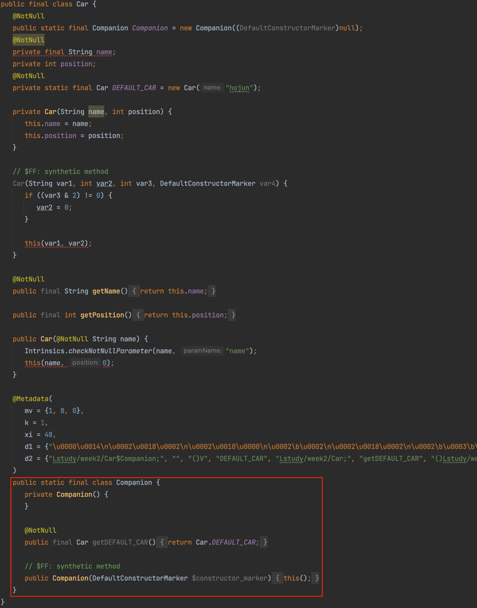
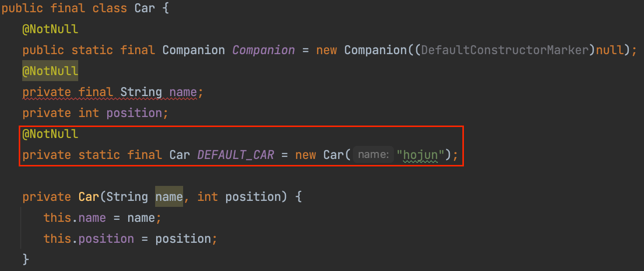
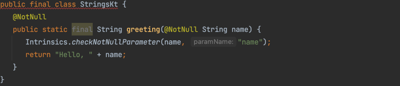
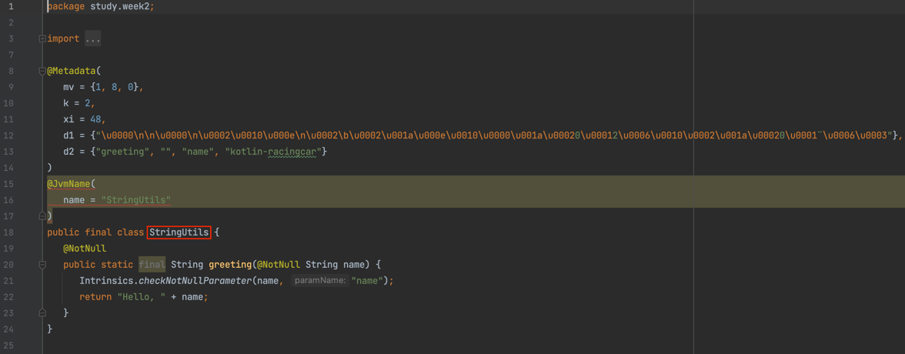

# TDD, 클린 코드 with Kotlin 7기

## 2주차 - 자동차 경주 피드백

### 목차

1. Java Inner 클래스 정리
2. 상수 객체는 어떻게 만들 수 있을까?
3. 최상위 함수는 클래스 없이 어떻게 동작되는가?
4. Companion Object 안에 선언된 메서드를 static 하게 선언하려면 어떻게 해야할까?

<br/>

### Java Inner 클래스 정리

동반 객체(companion object)를 학습하기 전에 Java Inner 클래스를 먼저 정리해보자.
Java의 정석 403~409 페이지를 참고했다.

#### 내부 클래스란?

- 내부 클래스는 클래스 내에 선언된 클래스이다.

#### 내부 클래스는 왜 사용하나요?

- 한 클래스를 다른 클래스의 내부 클래스로 선언하면 두 클래스의 멤버들 간에 서로 쉽게 접근할 수 있다는 장점과 외부에는 불필요한 클래스를 감춤으로써 코드의 복잡성을 줄일 수 있다는 장점을 얻을 수 있다.

#### 내부 클래스의 종류와 특징

| 내부 클래스                   | 특징                                                  |
|--------------------------|-----------------------------------------------------|
| 인스턴스 클래스(instance class) | 외부 클래스의 멤버변수 선언위치에 선언하며, 외부 클래스의 인스턴스멤버처럼 다루어진다.    |
| 스태특 클래스(static class)    | 외부 클래스의 멤버변수 선언위치에 선언하며, 외부 클래스의 static멤버처럼 다루어진다.  |
| 지역 클래스(local class)      | 외부 클래스의 메서드나 초기화 블럭 안에 선언하며, 선언된 영역 내부에서만 사용할 수 있다. |

- 인스턴스 클래스와 스태틱 클래스는 외부 클래스의 멤버변수와 같은 위치에 선언되며, 멤버변수와 같은 성질을 갖는다.
    - 클래스 앞에 private, protected과 같은 접근제어자를 사용할 수 있다.
- 인스턴스멤버와 static멤버 간의 규칙이 내부 클래스에도 똑같이 적용된다.
    - 인스턴스멤버는 같은 클래스에 있는 인스턴스멤버와 static멤버 모두 직접 호출이 가능하지만, static멤버는 인스턴스멤버를 직접 호출할 수 없는 것처럼, 인스턴스클래스는 외부 클래스의 인스턴스멤버를
      객체 생성 없이 바로 사용할 수 있지만, 스태틱 클래스는 외부 클래스의 인스턴스멤버를 객체 생성 없이 사용할 수 없다.
    - 내부 클래스 중에서 스태틱 클래스만 static 멤버를 가질 수 있다.
    - 다만, final과 static이 동시에 붙은 변수는 상수이므로 모든 내부 클래스에서 정의가 가능하다.
- 내부 클래스도 클래스이기 때문에 abstract, final 같은 제어자를 사용할 수 있다.

```java
class Outer {
    private int outerIv = 0;
    static int outerCv = 0;

    class InstanceInner {
        int iv = 100;
        static int cv = 100; // 에러! static 변수를 "선언"할 수 없다.
        final static int CONST = 100; // final static은 상수이므로 허용
        int iiv = outerIv; // 외부 클래스의 private 멤버도 접근 가능하다.
        int iiv2 = outerCv; // 외부 클래스의 static 멤버도 접근 가능하다.
    }

    static class StaticInner {
        int iv = 200;
        int sv = outerIv; //  에러! static 클래스는 외부 클래스의 인스턴스멤버에 접근할 수 없다.
        static int cv = 200; // static 클래스만 static 멤버를 정의할 수 있다.
        static int siv = outerCv;
    }

    void myMethod() {
        class LocalInner {
            int iv = 300;
            static int cv = 300; // 에러! static 변수를 선언할 수 없다.
            final static int CONST = 300; // final static은 상수이므로 허용
        }
    }
}
```

<br/>

### 상수 객체는 어떻게 만들 수 있을까?

```kotlin
// Kotlin 코드
class Car {
    companion object {
        const val DEFAULT_POSITION: Int = 0
        const val DEFAULT_NAME: String = ""
        val DEFAULT_CAR: Car = Car("hojun") // 객체 앞에는 const 키워드를 붙일 수 없다.
    }
}
```

```java
// Java 코드
public class Application {
    public static void main(String[] args) {
        // 상수 객체를 접근하는 방법이 너무 어렵다!
        final var car = Car.Companion.getDEFAULT_CAR();

        // 아래 처럼 할 수는 없을까...?
        final var car = Car.DEFAULT_CAR();
    }
}
```

- Primitive 타입 변수 앞에는 const 키워드를 붙여 상수(public static)로 선언할 수 있다.
- 객체 타입 변수 앞에는 const 키워드를 붙일 수 없다.
- Car 클래스 코드는 아래의 Java 코드로 변환된다. 상수 객체로 선언한 `DEFAULT_CAR`는 `Companion` 클래스 안에 프로퍼티 형태로 존재하게 된다.



- `@JvmField` 어노테이션을 이용하면 객체를 프로퍼티가 아닌 상수(public static)로 선언할 수 있다.

```kotlin
class Car {
    companion object {
        const val DEFAULT_POSITION: Int = 0
        const val DEFAULT_NAME: String = ""

        @JvmField
        val DEFAULT_CAR: Car = Car("hojun") // 객체 앞에는 const 키워드를 붙일 수 없다.
    }
}
```



<br/>

### 3. 최상위 함수는 클래스 없이 어떻게 동작되는가?

```kotlin
// Strings.kt 파일
fun greeting(name: String): String = "Hello, $name"
```

- 최상위 함수를 품은 파일명(StringsKt)을 이름으로 하는 클래스가 생성되고, 최상위 함수가 static 메서드로 선언된다.



- Java 클라이언트 코드는 아래와 같이 최상위 함수를 호출할 수 있을 것이다.

```java
class Application {
    public static void main(String[] args) {
        StringsKt.greeting("hojun");
    }
}
```

- 최상위 함수가 `StringsKt` 대신 원하는 이름의 클래스에 선언될 수 있도록 할 수 없을까?
- `@JvmName` 어노테이션을 활용하면 된다.

```kotlin
@file:JvmName("StringUtils")

fun greeting(name: String): String = "Hello, $name"
```



<br/>

### Companion Object 안에 선언된 메서드를 static 하게 선언하려면 어떻게 해야할까?

Parameterized Test를 수행할 경우, 아래와 같이 정적 팩토리 메서드가 필요하다.

```kotlin
class MyTest {

    @MethodSource("factory")
    @ParameterizedTest
    fun test(value: String) {
        value shouldBe "1"
    }

    companion object {
        @JvmStatic
        fun factory(): List<String> {
            return listOf("1")
        }
    }
}
```

- 하지만, companion object 안에 존재한다고해서 `factory()` 메서드는 static 메서드로 선언되지 않는다.
- companion object 안에 static 메서드를 선언하려면 `@JvmStatic` 어노테이션을 활용하면 된다.

### 코딩 컨벤션

- 클래스는 프로퍼티, 초기화 블록, 부 생성자, 함수, 동반 객체 순으로 작성한다.

```kotlin

import kotlin.random.Random

class Car(val name: String, position: Int = DEFAULT_POSITION) {
    var position: Int = position
        private set

    fun move() {
        if (getRandomNumber() >= FORWARD_NUMBER) position++
    }

    private fun getRandomNumber() {
        return Random.nextInt(MAX_BOUND)
    }

    companion object {
        const val DEFAULT_POSITION: Int = 0
        const val FORWARD_NUMBER: Int = 4
        const val MAX_BOUND: Int = 9
    }
}
```

### 스마트 캐스트

```kotlin
fun calculate(text: String?): Int {
    // text를 사용할 때 마다 매번 safe-call 필요
    text?.toInt()
    text?.toInt()
    text?.toInt()
    text?.toInt()
}
```

- text를 사용할 때 마다 매번 safe-call을 해줘야하는 불편함이 있다

```kotlin
fun calculate(text: String?): Int {
    if (text.isNullOrBlank()) {
        return 0
    } // null 체크 조건문을 통과하는 순간 컴파일러는 text가 null이 아니라는 것을 알게 되므로 자동 타입 캐스트를 해준다.
    text.toInt() // safe-call을 하지 않아도 된다.
    text.toInt()
    text.toInt()
    text.toInt()
}
```

- null 체크 조건문을 통과하는 순간 컴파일러는 text가 null이 아니라는 것을 알게 되므로 `String` 타입으로 자동 캐스트 해준다.
- 따라서 조건문 이후 코드에서 safe-call을 하지 않아도 된다.

```kotlin
fun calculate(text: String?): Int {
    require(!text.isNullOrBlank()) { "유효하지 않은 값입니다." }
    text.toInt()
    text.toInt()
    text.toInt()
    text.toInt()
}
```

- `require` API를 이용하면 검증 후 표준 예외를 던지는 코드를 짧게 줄일 수 있다.
- `require` API를 사용해도 하단 코드에서 스마트 캐스트가 적용된다.

### Jason Effectively Kotlin Item

- `!!` 키워드를 사용하는 것은 코틀린을 잘못 사용하고 있다는 시그널이다.
- import문에 java, javax, jakarta 가 적을수록 코틀린을 효율적으로 사용하고 있다는 시그널이다.
    - 플랫폼(java, js, native 등)에 의존하지 않는 코드라면 플랫폼이 변경되어도 코드는 동작한다.

---

## 2주차 - TDD

- TDD의 개발 방법론이다. 개발은 디자인(설계)를 전제로 한다.
- 따라서 개발에 앞서, 요구사항을 분석하고 대략적인 설계(객체 추출)을 해야 한다.
- UI, DB 등 복잡한 영역은 생략하고 핵심 도메인 로직 설계에 집중한다. TDD 는 빠르게 개발하는 XP(Extreme Programming)로 부터 시작된 개념이며, XP에서는 과도한 설계를 지양한다. 우선
  설계가 부족하다는 것을 인정한 채 빠르게 개발해보고, 변경사항은 나중에 추가한다.
- 테스트케이스를 작성하고 기능 구현을 통해 테스트케이스를 통과시키는 과정을 반복하다보면 도메인 지식이 늘어간다. 새로 알게된 지식을 바탕으로 테스트케이스를 보강해 나간다.
