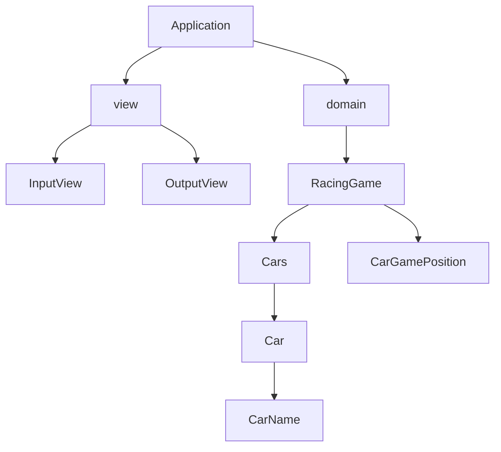

# kotlin-racingcar

```
- 주어진 횟수 동안 n대의 자동차는 전진 또는 멈출 수 있다.
- 사용자는 몇 대의 자동차로 몇 번의 이동을 할 것인지를 입력할 수 있어야 한다.
- 전진하는 조건은 0에서 9 사이에서 무작위 값을 구한 후 무작위 값이 4 이상일 경우이다.
- 자동차의 상태를 화면에 출력한다. 어느 시점에 출력할 것인지에 대한 제약은 없다.
```

### car
- [x] 자동차는 현재 본인의 위치를 가진다.
- [x] 새로 생성될 자동차의 최초 위치는 0이다.
- [x] 자동차의 이동에 입력되는 값는 랜덤하게 들어온다.
- [x] 자동차는 이동 전략에서 movable이 true면 전진한다.
- [x] 자동차는 이동 전략에서 movable이 false면 움직이지 않는다.

### RandomMove
- 0 ~ 9의 값을 랜덤하게 생성한다.
- 4 이상인 경우 true를 반환한다.
- 4 미만인 경우 false를 반환한다.

### RacingGame
- [x] 자동차의 대수와, 시도 횟수를 받아 게임을 생성한다.
- [x] 자동차의 대수가 1보다 작으면 예외가 발생한다.
- [x] 시도 횟수가 1보다 작으면 예외가 발생한다.
- [x] 게임을 실행하면 시도 횟수를 1만큼 차단하고 자동차들을 움직인다.
- [x] 시도 횟수가 0인데 게임을 실행하려고 하면 예외가 발생한다.
- [x] 게임이 종료되었는지 확인할 수 있다.

### input view
- 자동차의 대수를 입력받을 수 있다.
  - [x] 자동차의 대수는 숫자로만 입력가능하다.
- 게임을 몇회 시도할지 입력받을 수 있다.
  - [x] 시도 횟수는 숫자로만 입력가능하다.
```
자동차 대수는 몇 대인가요?
3
시도할 횟수는 몇 회인가요?
5
```

### output view
- [x] 자동차의 위치를 매 시도횟수마다 출력한다.
  - 출력은 1거리당 "-"으로 출력한다.
```
실행 결과
-
-
-

--
-
--

---
--
---

----
---
----

----
----
-----
```

## 우승자
```
각 자동차에 이름을 부여할 수 있다. 자동차 이름은 5자를 초과할 수 없다.
전진하는 자동차를 출력할 때 자동차 이름을 같이 출력한다.
자동차 이름은 쉼표(,)를 기준으로 구분한다.
자동차 경주 게임을 완료한 후 누가 우승했는지를 알려준다. 우승자는 한 명 이상일 수 있다.
```

### car
- [x] 자동차는 현재 본인의 위치를 가진다.
- [x] 새로 생성될 자동차의 최초 위치는 0이다.
- [x] 자동차의 이동에 입력되는 값는 랜덤하게 들어온다.
- [x] 자동차는 이동 전략에서 movable이 true면 전진한다.
- [x] 자동차는 이동 전략에서 movable이 false면 움직이지 않는다.
#### CarName
- [x] 자동차는 이름을 가진다.
- [x] 자동차의 이름은 5자를 초과하면 예외가 발생한다.
- [x] 자동차의 이름이 공백인 경우 예외가 발생한다.

### RandomMove
- 0 ~ 9의 값을 랜덤하게 생성한다.
- 4 이상인 경우 true를 반환한다.
- 4 미만인 경우 false를 반환한다.

### Cars
- [x] 자동차의 대수와, 시도 횟수를 받아 게임을 생성한다.
- [x] 자동차의 대수가 1보다 작으면 예외가 발생한다.
- [x] 모든 자동차를 run할 수 있다.
- [x] 현재 선두에 있는 자동차의 이름을 알 수 있다.

### RacingGame
- [x] 시도 횟수가 1보다 작으면 예외가 발생한다.
- [x] 게임을 실행하면 시도 횟수를 1만큼 차단하고 자동차들을 움직인다.
- [x] 시도 횟수가 0인데 게임을 실행하려고 하면 예외가 발생한다.
- [x] 게임이 종료되었는지 확인할 수 있다.
- [x] 게임의 우승자 이름을 확인할 수 있다.
- [x] 게임이 종료되지 않았는데 우승자를 확인하면 예외가 발생한다.

### input view
- 자동차의 이름을 입력받을 수 있다.
  - 자동차의 이름은 쉼표(,)를 기준으로 구분한다. 
- 게임을 몇회 시도할지 입력받을 수 있다.
  - [x] 시도 횟수는 숫자로만 입력가능하다.
```
경주할 자동차 이름을 입력하세요(이름은 쉼표(,)를 기준으로 구분).
pobi,crong,honux
시도할 횟수는 몇 회인가요?
5
```

### output view
- 자동차의 위치를 매 시도횟수마다 출력한다.
  - [x] 자동차의 이름을 함꼐 출력한다.
  - [x] 출력은 1거리당 "-"으로 출력한다.
- 자동차의 경주의 우승자를 출력한다.
  - [x] 출력 시 이름의 구분자는 ","로 한다.
```
실행 결과
pobi : -
crong : -
honux : -

pobi : --
crong : -
honux : --

pobi : ---
crong : --
honux : ---

pobi : ----
crong : ---
honux : ----

pobi : -----
crong : ----
honux : -----

pobi, honux가 최종 우승했습니다.
```

## 리팩터링
```
핵심 비지니스 로직을 가지는 객체를 domain 패키지, UI 관련한 객체를 view 패키지에 구현한다.
MVC 패턴 기반으로 리팩토링해 view 패키지의 객체가 domain 패키지 객체에 의존할 수 있지만, domain 패키지의 객체는 view 패키지 객체에 의존하지 않도록 구현한다.
```


