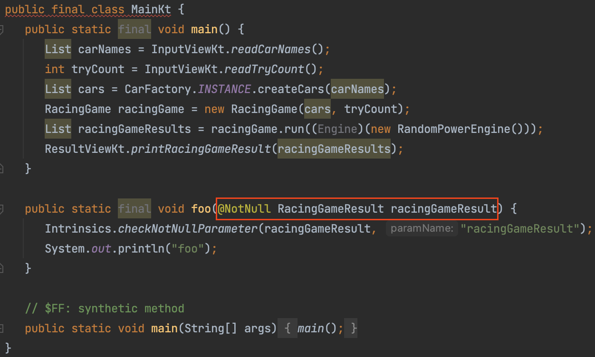
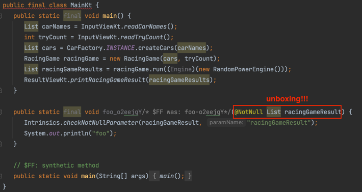

# Mission with Kotlin in Action

Kotlin in Action 을 읽으면서 학습한 내용이 미션에 어떻게 적용됐는지 기록합니다.

## 정적인 멤버 선언하기

매직 넘버를 상수로 정의해야 할 경우가 존재합니다.
코틀린은 클래스 안에 정적인 멤버를 정의할 수 없으며 static 키워드를 지원하지 않습니다.
코틀린에서 정적인 멤버를 선언하는 방법에 대해 배워봅니다.

### 최상위 함수

- 코틀린에서는 패키지 수준의 최상위 함수, 프로퍼티를 사용할 수 있습니다.
- 최상위 함수는 자바의 정적 메서드 역할을 거의 대신할 수 있습니다.
- 최상위 프로퍼티를 활용해 코드에 상수를 추가할 수 있습니다.
    - 최상위 프로퍼티도 다른 모든 프로퍼티처럼 접근자 메서드를 통해 자바 코드에 노출됩니다.
    - 상수답게 사용하려면 const 변경자를 추가하여 public static final 필드로 컴파일 할 수 있습니다.

```kotlin
@file:JvmName("MyFunctions")

package example

var opCount = 0 // getter, setter 함수가 노출된다

const val UNIX_LINE_SEPARATOR = "\n" // public static final 필드로 컴파일된다

fun performOperation() {
    opCount++
}
```

### 동반 객체(Companion Object)

- 정적인 멤버를 선언해야 할 경우, 대부분 최상위 함수를 활용하는 편을 더 권장합니다.
- 하지만, 최상위 함수는 private으로 표시된 클래스 비공개 멤버에 접근할 수 없으므로, 클래스 내부 정보에 접근해야 하는 함수가 필요할 때는 클래스에 중첩된 객체 선언을 활용해야 합니다.

```kotlin
class A {
    private val foo = "foo"

    companion object {
        fun inner(a: A) {
            a.foo // ok...! (private 멤버 접근 가능)
        }
    }
}

fun top(a: A) {
    a.foo // error...! (private 멤버 접근 불가)
}
```

### 무엇을 사용할까...?

| 최상위 함수                                    | 동반 객체                                         |
|-------------------------------------------|-----------------------------------------------|
| 상수를 사용하려면 상수명을 외워야 한다.                    | 클래스에 점(.)을 찍어 상수명에 접근할 수 있다.                  |
| private로 설정하더라도, 같은 파일 내의 클래스에서 사용이 가능하다. | private로 설정할 경우, 같은 파일 내의 다른 클래스에서 사용이 불가능하다. |

## 객체 생성시 값 검증하기

객체 생성시 멤버 변수의 값을 검증해야 할 경우가 있습니다.
코틀린에서 제공하는 객체 생성과 관련된 키워드를 학습하여 요구사항을 달성할 수 있습니다.

### 주생성자(primary constructor)

```kotlin
class User(val nickname: String)
```

- 보통 클래스의 모든 선언은 중괄호({}) 사이에 들어간다. 중괄호가 없고 괄호 사이에 val 선언만 존재할 때, 클래스 이름 뒤에 오는 괄호로 둘러싸인 코드를 **주생성자(primary constructor)**
  라고 부른다.

### init

```kotlin
class User constructor(nickname: String) { // 파라미터가 하나만 있는 주 생성자
    val nickname: String

    init { // 초기화 블록
        this.nickname = _nickname
    }
}
```

- 주생성자를 명시적인 선언으로 풀어내면 위와 같다.
- constructor 키워드는 주 생성자나 부 생성자 정의를 시작할 때 사용된다.
- init 키워드는 초기화 블록을 시작한다. 초기화 블록에는 클래스의 객체가 만들어질 때 실행될 초기화 코드가 들어간다. 주 생성자는 별도의 코드를 포함할 수 없으므로 초기화 블록이 필요하다.

### 간결하게 만들기

```kotlin
class User(_nickname: String) {
    val nickname = _nickname // 프로퍼티를 주생성자의 파라미터로 초기화한다.
}
```

- 주 생성자 앞에 별다른 애노테이션이나 가시성 변경자가 없다면 constructor를 생략해도 된다.
- 프로퍼티를 초기화하는 식, 또는 init 블록을 통해 주 생성자의 파라미터를 참조할 수 있다.

```kotlin
class User(val nickname: String)
```

- 주생성자 파라미터 이름 앞에 val을 추가하는 방식으로 프로퍼티 정의와 초기화를 간략히 쓸 수 있다.

## 싱글턴 객체 생성하기

- object 선언은 싱글턴을 정의하는 방법 중 하나다.
- 클래스와 마찬가지로 객체 선언 안에도 프로퍼티, 메서드, 초기화 블록 등이 들어갈 수 있다.
- 하지만, 생성자는(주생성자와 부생성자 모두) 객체 선언에 쓸 수 없다.
- 일반 클래스 인스턴스와 달리 싱글턴 객체는 객체 선언문이 있는 위치에서 생성자 호출 없이 즉시 만들어진다. 따라서 object 선언에는 생성자 정의가 필요 없다.
- 예를 들어, Comparator를 구현할 때, 각 클래스마다 하나의 객체면 충분하다. 따라서 Comparator 인스턴스를 만드는 방법으로는 object 선언이 가장 좋은 방법이다.

```kotlin
object CaseInsensitiveFileComparator : Comparator<File> {
    override fun compare(file1: File, file2: File): Int {
        return file1.path.compareTo(file2.path, ignoreCase = true)    
    }
}
```

- object는 유일한 인스턴스에 대한 정적인 필드가 있는 자바 클래스로 컴파일된다.
- 이때 인스턴스 필드의 이름은 항상 INSTANCE다.
- 자바 코드에서 코틀린 object를 사용하려면 INSTANCE 필드에 접근하면 된다.

```
CaseInsensitiveFileComparator.INSTANCE.compare(file1, file2);
```

## 늦은 초기화하기

- 일반적으로 프로퍼티는 생성자에서 초기화해야 한다.
- 그러나 그렇게 하는 것이 불편한 경우가 종종 있다.
  - 의존성 주입을 통해 초기화되는 경우
  - 단위 테스트의 설정 메서드에서 초기화되는 경우
- 프로퍼티를 생성자가 아닌 곳에서 초기화할 경우, 클래스 본문 내에서 프로퍼티 참조시 널 검사에 의한 오류가 발생할 것이다.
- 널 검사를 피하고 싶다면, `lateinit` 제어자를 사용하면 된다.

```kotlin
class MyTest {
    lateinit var subject: TestSubject

    @SetUp fun setup() {
        subject = TestSubject()
    }

    @Test fun test() {
        subject.method()  // dereference directly
    }
}
```

참고자료: https://kotlinlang.org/docs/properties.html#late-initialized-properties-and-variables

## 일급 컬렉션이란?

- **Collection**을 **Wrapping**하면서, 그 외 다른 멤버 변수가 없는 상태
- 일급 컬렉션은 아래의 장점을 지닌다.
  - 비지니스에 종속적인 자료구조
  - 상태와 행위를 한 곳에서 처리
- 구현 방법에 따라 불변성을 보장할 수도, 아닐수도 있다. 불변성을 보장하는 일급 컬렉션을 만드는 방법은 아래의 코드 참조하면 된다.

```java
public class Lotto {
  private final List<Integer> lottoNumbers;

  // 불변성 보장 X
  // 외부에서 파라미터로 전달하는 lottoNumbers를 조작할 수 있음!!!
  public Lotto(List<Integer> lottoNumbers) {
    this.lottoNumbers = lottoNumbers;
  }
  
  // 불변성 보장 장치1
  // 외부에서 파라미터로 전달하는 lottoNumbers의 값을 복사해서 멤버로 초기화하면
  // 외부로부터의 접근을 방지할 수 있음 -> 불변성 보장 
  public Lotto(List<Integer> lottoNumbers) {
    this.lottoNumbers = new ArrayList<>(lottoNumbers);
  }

  // 불변성 보장 장치2
  // 외부에서 컬렉션 변경을 금지
  public List<Integer> getLottoNumbers() {
    return Collections.unmodifiableList(lottoNumbers);
  }
}
```

### 한 발 더 나아가기: Inline class
- 비즈니스 로직상 가끔 어떤 타입을 둘러싼 래퍼 클래스가 필요한 경우가 있다.
- wrapper 클래스로 둘러싸여진 타입이 primitive 타입이라면, 성능은 더욱 악화된다. 왜냐하면 primitive 타입의 성능 최적화 이점을 누릴 수 없기 때문이다.
  - primitive 타입이 wrapper 타입에 비해 성능이 왜 더 좋을까? (내 생각임)
    - primitive 타입 데이터는 stack 영역에 저장되므로 곧바로 접근할 수 있다.
    - 반면에, wrapper 타입은 heap 영역에 객체로 저장된다. stack 영역의 참조변수를 통해 접근할 수 있다. 이 때, 참조변수에는 데이터가 할당된 것이 아니라, heap 영역에 있는 객체의 주소가 저장되어 있기 떄문에 한 번의 이동이 발생한다. 
- wrapper 클래스 선언으로 인한 성능 저하를 해결하기 위해 inline class 가 등장했다.
- inline 클래스를 선언하려면 클래스에 `@JvmInline` 어노테이션과 함께 `value` 변경자를 붙이면 된다.
- inline 클래스는 반드시 주 생성자에 하나의 프로퍼티를 선언해야 한다.
- 런타임시, inline 클래스의 인스턴스는 상황에 따라 프로퍼티로 대체된다. (마치 Integer 클래스가 상황에 따라 int 타입으로 unboxing 되는 것과 비슷한 원리)
- inline 클래스는 프로퍼티, 함수, `init` 블록, 부 생성자를 정의할 수 있다.
- inline 클래스는 [backing 필드](https://kotlinlang.org/docs/properties.html#backing-fields), [delegated 프로퍼티](https://kotlinlang.org/docs/delegated-properties.html), `lateinit`를 제공하지 않는다.
- inline 클래스는 항상 final이며, 확장이 불가능하다.

```kotlin
// Inline class 선언 예시
@JvmInline
value class Password(private val s:String)
```

<br/>

```kotlin
// Main.kt
//...
fun foo(racingGameResult: RacingGameResult) {
  println("foo")
}
//...
```

미션 수행 과정 중 구현한 `RacingGameResult`을 inline 클래스로 선언했을 때와 아닐 때의 차이를 알아보기 위해 `Main.kt` 파일의 자바 코드를 살펴봤다.


#### `RacingGameResult`가 일반 클래스일 때 



#### `RacingGameResult`가 inline 클래스일 때


#### 참고자료
- https://kotlinlang.org/docs/inline-classes.html
- https://www.youtube.com/watch?v=LpqvtgibbsQ&t=30
- https://tecoble.techcourse.co.kr/post/2020-05-08-First-Class-Collection/
- https://jojoldu.tistory.com/412
- https://shanepark.tistory.com/449

