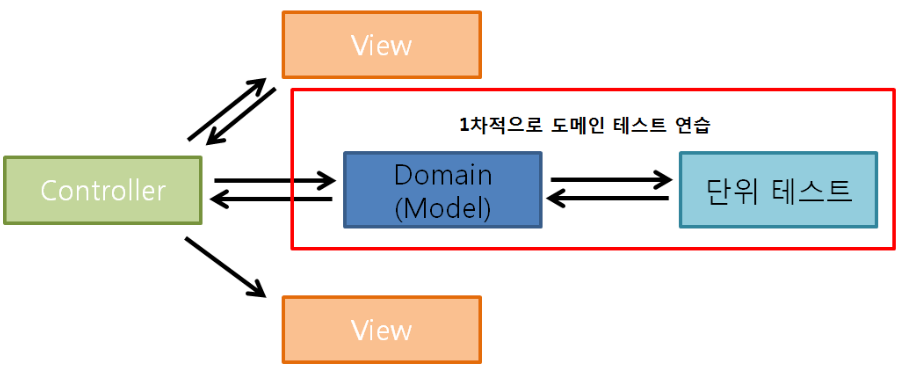
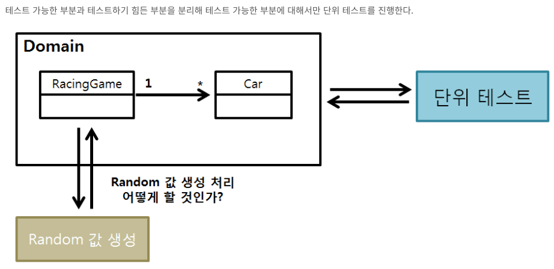

# **🚀 3단계 - 자동차 경주**

## 기능 요구 사항

---

초간단 자동차 경주 게임을 구현한다

- 주어진 횟수 동안 n대의 자동차는 전진 또는 멈출 수 있다.
- 사용자는 몇 대의 자동차로 몇 번의 이동을 할 것인지를 입력할 수 있어야 한다.
- 전진하는 조건은 0에서 9사이에서 무작위 값을 구한 후 무작위 값이 4 이상일 경우이다.
- 자동차의 상태를 화면에 출력한다. 어느 시점에 출력할 것인지에 대한 제약은 없다.
- 각 자동차에 이름을 부여할 수 있다. 자동차 이름은 5자를 초과할 수 없다.
- 전진하는 자동차를 출력할 때 자동차 이름을 같이 출력한다.
- 자동차 이름은 쉼표(,) 기준으로 구분한다.
- 자동차 경주 게임을 완료한 후 누가 우승했는지를 알려준다. 우승자는 한 명 이상일 수 있다.
- 핵심 비지니스 로직을 가지는 객체를 domain 패키지, UI 관련한 객체를 view 패키지에 구현한다.
- MVC 패턴 기반으로 리팩토링해 view 패키지의 객체가 domain 패키지 객체에 의존할 수 있지만, domain 패키지의 객체는 view 패키지 객체에 의존하지 않도록 구현한다.




## 실행 결과

---

위 요구 사항에 따라 3대의 자동차가 5번 움직였을 경우 프로그램을 실행한 결과는 다음과 같다.

```
경주할 자동차 이름을 입력하세요(이름은 쉼표(,)를 기준으로 구분).
pobi,crong,honux
시도할 횟수는 몇 회인가요?
5

실행 결과
pobi : -
crong : -
honux : -

pobi : --
crong : -
honux : --

pobi : ---
crong : --
honux : ---

pobi : ----
crong : ---
honux : ----

pobi : -----
crong : ----
honux : -----

pobi, honux가 최종 우승했습니다.

```

## 프로그래밍 요구 사항

- 모든 로직에 단위 테스트를 구현한다. 단 UI(System.out, System.in) 로직은 제외
    - 핵심 로직을 구현하는 코드와 UI 를 담당하는 로직을 구분한다.
    - UI 로직을 InputView, ResultView 와 같은 클래스를 추가해 분리한다.
- indent(인덴트, 들여쓰기) depth를 2를 넘지 않도록 구현한다. 1까지만 허용한다.
   - 예를 들어 while문 안에 if문이 있으면 들여쓰기는 2이다.
   - 힌트: indent(인덴트, 들여쓰기) depth를 줄이는 좋은 방법은 함수(또는 메소드)를 분리하면 된다.
- 함수(또는 메소드)의 길이가 15라인을 넘어가지 않도록 구현한다.
   - 함수(또는 메소드)가 한 가지 일만 잘 하도록 구현한다.
- 기능을 구현하기 전에 README.md 파일에 구현할 기능 목록을 정리해 추가한다. 
- git의 commit 단위는 앞 단계에서 README.md 파일에 정리한 기능 목록 단위로 추가한다.

## 힌트

- 값을 입력 받는 API 는 `[kotlin.io](http://kotlin.io)` 의 `readLine` 을 이용한다.
- 사용자가 입력한 이름의 숫자 만큼 자동차 대수를 생성한다.
- 자동차는 자동차 이름과 위치 정보를 가지는 Car 객체를 추가해 구현한다.

---

### 기능 실행 순서

1. 자동차 대수와 시도할 횟수를 입력한다.
2. 입력받은 자동차 대수 만큼 자동차 객체를 생성한다.
3. 0~9 값이 나오는 랜덤함수를 각 자동차 객체마다 호출한다.
4. 값이 4이상이면 자동차를 이동한다 
   1. 자동차의 거리를 증가시킨다.
   2. 자동차 이동의 상태를 출력한다.
5. 2~3 의 과정을 입력받은 시도할 횟수만큼 반복한다.
6. 반복이 끝나면 종료한다.

### 기능 구현 목록

- [x] Car 클래스 생성
  - [x] 프로퍼티(distance, moving strategy)
- [x] InputValidator 클래스 생성
- [X] 0-9 사이의 무작위 값을 생성하는 랜덤 함수 (인터페이스와 구현체로 만들 것)
- [X] InputView 클래스 생성
- [X] ResultView 클래스 생성
- [x] 확장 함수 생성
  - greaterThanOrEqual
  - isPositive: 양의 정수인지 확인하는 메서드
- [X] RacingService 생성
    - race 메서드 생성 - 1회의 전진 시도를 한다.
- [x] 자동차의 리스트를 가진 일급컬렉션 생성
- [x] Car 객체에 이름 프로퍼티를 추가
- [X] 입력 받은 자동차의 이름을 `,` 기준으로 파싱하는 기능 추가
- [x] 우승자를 반환하는 메서드 추가 (Cars 에서?)
- [x] ResultView 에서 Car 객체의 이름도 같이 출력되도록 수정
- [x] ResultView 에서 우승자 리스트 출력 기능 추가
- [x] Name (자동차 이름) value class 생성
- [ ] TryCount (시도횟수) value class 생성

### 테스트 케이스 목록

- [x]  시도횟수에 대한 validation 
   - [x] 입력 값은 양의 정수여야 한다.
   - [x] 입력 값은 숫자여야 한다.
- [X]  자동차 대수 입력값 만큼 자동차 객체가 생겨야 한다.
- [X]  랜덤값 반환 함수는 입력한 범위내에서만 반환되어야 한다.
- [x]  greaterThanOrEqual 확장함수가 제대로 작동하는지 확인한다.
- [x]  isPositive 확장함수가 제대로 작동하는지 확인한다
- [X]  이동룰을 만족했을 때 Car 객체의 distance 가 잘 증가한다.
- [x]  시도할 횟수만큼 경기가 진행되어야 한다.
- [x]  X대의 자동차 중 점수가 가장 높은 대수 만큼 우승자가 나와야 한다.
- [x]  모든 자동차가 전진에 실패하였다면 우승자는 없다. (내가 만든 룰)
 
---

### 피드백

- 가변자료형은 최대한 지양하기
- repeat 함수 용도 용법에 맞게 사용해보기
- 같은 인스턴스를 여러번 생성하지 않도록 짜기
- 외부에서 객체의 프로퍼티들의 대한 접근제한
   - (참고) https://mangkyu.tistory.com/147 

